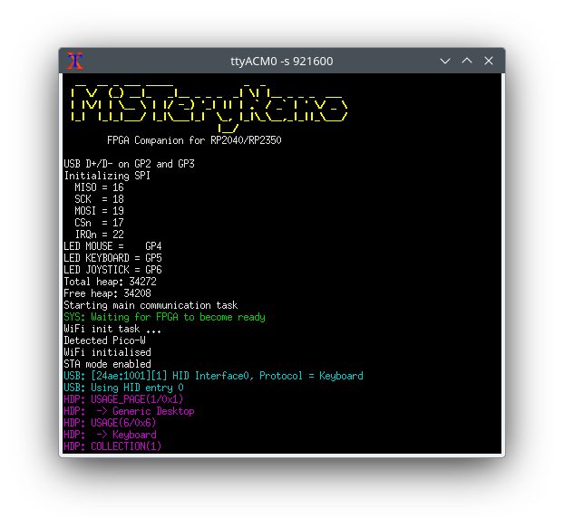

# Debugging the FPGA Companion

The FPGA Companion may not act as expected and e.g. may not detect or
accept USB devices. In this case the serial debug output of the
FPGA Companion may be helpful.

All currently supported MCUs do some debug output on one of the MCUs
pins although with different serial speeds. The Raspberry Pi Pico or
Pico-W use 921600 bit/s, the Waveshare RP2040 Zero uses 460800 bit/s,
the ESP32 uses 115200 bit/s and the BL616 uses 2000000 bit/s.

The output is similar in all cases:

```
  __  __ _ ___ _____             _  _               
 |  \/  (_) __|_   _|__ _ _ _  _| \| |__ _ _ _  ___ 
 | |\/| | \__ \ | |/ -_) '_| || | .` / _` | ' \/ _ \
 |_|  |_|_|___/ |_|\___|_|  \_, |_|\_\__,_|_||_\___/
                            |__/                    
        FPGA Companion for RP2040/RP2350

USB D+/D- on GP2 and GP3
Initializing SPI
  MISO = 16
  SCK  = 18
  MOSI = 19
  CSn  = 17
  IRQn = 22
LED MOUSE =    GP4
LED KEYBOARD = GP5
LED JOYSTICK = GP6
Total heap: 34272
Free heap: 34208
Starting main communication task
SYS: Waiting for FPGA to become ready
WiFi init task ...
Detected Pico-W
WiFi initialised
STA mode enabled
USB: [24ae:1001][1] HID Interface0, Protocol = Keyboard
USB: Using HID entry 0
HDP: USAGE_PAGE(1/0x1)
HDP:  -> Generic Desktop
HDP: USAGE(6/0x6)
HDP:  -> Keyboard
HDP: COLLECTION(1)
...
```

During usage further information may be printed. Some additional debug
statements may be enabled in the code. Some debug output is suppressed
to not slow the FPGA Companion down too much.

The output actually uses ANSI color and should look like this on a
terminal supporting that:


