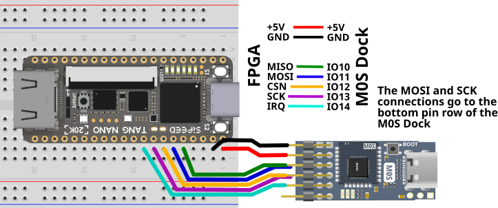

# MiSTeryNano FPGA companion BL616 variant

The is the variant of the MiSTeryNano FPGA companion firmware
for the BL616 MCU (M0S Dock).

> [!IMPORTANT]
> * Updated SDK have to be installed!  

## Example wiring

  

## Compiling and uploading code for the BL616 (Linux)

Download the Bouffalo toolchain:

```bash
git clone https://github.com/bouffalolab/toolchain_gcc_t-head_linux.git
```

and the Bouffalo SDK:  

Install Bouffalo SDK 2.0.0 fork with latest CherryUSB stack V1.43 included (**no WIFI function**).  

```bash
git clone --recurse-submodules https://github.com/harbaum/bouffalo_sdk.git
```

For a full **functional WIFI** SDK 2.0.1 and a CherryUSB patch need to be installed.  
No fork can be provided and an update need to be done on your own.

```bash
# In case of a previous install remove it by 
rm -rf bouffalo_sdk
git clone --recurse-submodules https://github.com/bouffalolab/bouffalo_sdk.git
git fetch origin 0444691f1299ba846324effb347ac083e803eaee  
git checkout 0444691f1299ba846324effb347ac083e803eaee 
# message shows something like: Release version 2.0.1 + 2 
# copy CherryUSB update into the repo from https://github.com/harbaum/bouffalo_sdk/releases
git apply cherryusb143.patch``
```

Compile the firmware:

```bash
git clone --recurse-submodules https://github.com/harbaum/FPGA-Companion.git
cd FPGA-Companion
git submodule init
git submodule update
CROSS_COMPILE=<where you downloaded the toolchain>/toolchain_gcc_t-head_linux/bin/riscv64-unknown-elf- BL_SDK_BASE=<where you downloaded the sdk>/bouffalo_sdk/ make
```

You can simplify the ```make``` a bit by setting in your bashrc BL_SDK_BASE and include the toolchain_gcc_t-head_linux in the search path.

```bash
nano ./bashrc
export BL_SDK_BASE=xyz 
PATH=$PATH:/abc/toolchain_gcc_t-head_linux/bin
```

A simple make or make CHIP=bl616 COMX=/dev/ttyACMxyz flash in your bl616 folder will do then.

### Flashing the firmware

The resulting binary can be flashed onto the M0S. If you don't have
further debugger or prorgammer hardware connected to the M0S Dock, then
you need to perform the following manual steps:

First, you need to unplug the M0S from USB, press the BOOT button and plug the M0S Dock back into the PCs USB with the
BOOT button still pressed. Once connected release the BOOT button. The device
should now be in bootloader mode and show up with its bootloader on the PC:

```bash
$ lsusb
...
Bus 002 Device 009: ID 349b:6160 Bouffalo Bouffalo CDC DEMO
...
```

Also an ACM port should have been created for this device as e.g.
reported in the kernel logs visible with ```dmesg```:

```text
usb 2-1.7.3.3: new high-speed USB device number 9 using ehci-pci
usb 2-1.7.3.3: config 1 interface 0 altsetting 0 endpoint 0x83 has an invalid bInterval 0, changing to 7
usb 2-1.7.3.3: New USB device found, idVendor=349b, idProduct=6160, bcdDevice= 2.00
usb 2-1.7.3.3: New USB device strings: Mfr=1, Product=2, SerialNumber=0
usb 2-1.7.3.3: Product: Bouffalo CDC DEMO
usb 2-1.7.3.3: Manufacturer: Bouffalo
cdc_acm 2-1.7.3.3:1.0: ttyACM3: USB ACM device
```

Once it shows up that way it can be flashed.  
If you have built the firmware yourself and have the SDK installed you can simply enter the following command:

```bash
BL_SDK_BASE=<where you downloaded the sdk>/bouffalo_sdk/ make CHIP=bl616 COMX=/dev/ttyACM3 flash
```

If you have downloaded the firmware from the [release page](https://github.com/harbaum/FPGA-Companion/releases) you can use the graphical [BLFlashCube](https://github.com/CherryUSB/bouffalo_sdk/tree/master/tools/bflb_tools/bouffalo_flash_cube) tool using the ```fpga_companion_bl616_cfg.ini``` file.

After successful download you need to unplug the device again and reinsert it *without* the BOOT button pressed to boot into the newly installed firmware.

## Compiling and uploading code for the BL616 (Windows 11)

Install [Git for Windows](https://gitforwindows.org)

Install [cmake for Windows](https://cmake.org/download)

Install Bouffalo RISC-V MCU toolchain

```shell
Open Start Search, type “cmd” or Win + R and type “cmd” 

cd %HOMEPATH%
git clone https://github.com/bouffalolab/toolchain_gcc_t-head_windows.git
```

And the Bouffalo SDK:  

Install Bouffalo SDK fork with latest CherryUSB stack V1.43.  

```shell
cd %HOMEPATH%
git clone --recurse-submodules https://github.com/harbaum/bouffalo_sdk.git
```

Set Windows SDK Environment Variable:  

```text
Open Start Search, type “env”, and select “Edit the system environment variables”.  
  
BL_SDK_BASE=C:\Users\xyzuser\bouffalo_sdk
```

Set Windows search PATH for Toolchain:  

```shell
C:\Users\xyzuser\toolchain_gcc_t-head_windows\bin
C:\Users\xyzuser\bouffalo_sdk\tools\make
C:\Users\xyzuser\bouffalo_sdk\tools\ninja
```

Close shell

```shell
exit
```

Open Start Search, type “cmd” or Win + R and type “cmd”  
check individually proper start of each single tool

```shell
make -v
cmake -version
ninja --help
riscv64-unknown-elf-gcc -v
```

Download FPGA companion repository

```shell
cd %HOMEPATH%/Documents
git clone --recurse-submodules https://github.com/harbaum/FPGA-Companion.git
cd FPGA-Companion
git submodule init
git submodule update
```

Compile the firmware:  

```shell
cd %HOMEPATH%/Documents\FPGA-Companion\src\bl616
make clean
make
```

Alternative compile option: [ninja](https://ninja-build.org). make clean and then make ninja

### Flashing the firmware

figure out µC bootloader COM port and use shell command to program:  
Press Windows + R keyboard shortcut to launch the Windows Run box, type “devmgmt.msc” , and click the OK button.  

Device Manager will open.  
Locate Ports (COM & LPT) in the list.  
Check for the COM ports by expanding the same.  

```shell
make CHIP=bl616 COMX=COMabc  flash
```

If you have downloaded the firmware from the [release page](https://github.com/harbaum/FPGA-Companion/releases) you can use the graphical [BLFlashCube](https://github.com/CherryUSB/bouffalo_sdk/tree/master/tools/bflb_tools/bouffalo_flash_cube) tool using the ```fpga_companion_bl616_cfg.ini``` file.

After successful download you need to unplug the device again and reinsert it *without* the BOOT button pressed to boot into the newly installed firmware.
