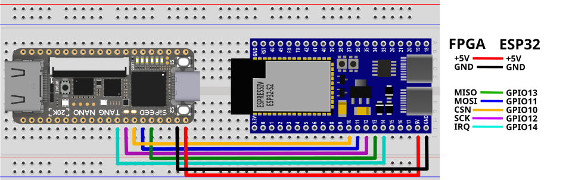

# MiSTeryNano FPGA companion ESP32 variant

The is the variant of the MiSTeryNano FPGA companion firmware
for the ESP32-S2 and ESP32-S3.

## USB Support

You need a ESP32 variant with native USB support, preferrably through
a second USB connector. Such a board has two USB-C connectors, one
usually being labeled COM and servicing a USB UART (COM port) as
typical for ESP32 boards and the second one giving access to the
ESP32's native USB port which can be operated in USB host mode to
connect a device like a keyboard or a mouse.

Currently the ESP32-S2 and ESP32-S3 are supported. Still, USB support
on these devices is rather limited and only one directly connected USB
device is supported. Hubs are not supported and thus the use of a
keyboard/mouse combo device makes the most sense for a retro home
computer setup.

### Hardware modifications

Most ESP32 boards that come with two USB ports are designed to
be powered from one of three power sources: The COM USB, the
native USB or an external 5V power source.

For this project it's preferred if the whole setup can be pwoered from
the COM USB port providing power to devices connected to the native
USB. Furthermore the FPGA may also be powered from this source.  Some
boards have solder jumpers e.g. labeled ```USB OTG``` and ```IN-OUT```
which can provide this. On other boards it may be necessary to
remove/bridge diodes.

## Features and limitations

  - Requires an ESP32 variante with USB host support (ESP32-S2 or S3)
  - Only one USB device possible (no hubs)

## Building

First specify which CPU you are using. Either

```
idf.py set-target esp32s2 
```

or

```
idf.py set-target esp32s3 
```

Then in ```esp-idf/components/fatfs/src/ffconf.h``` you need to
manually set
```
#define FF_USE_STRFUNC 1
#define FF_FS_EXFAT    1
```

Then enter the menu by
```
idf.py menuconfig
```

Navigate into ```Component Config``` and then
into ```FAT Filesystem Support```. There activate the
```Enable fast seek algorithm ...``` option,
set the ```Sector Size``` to 512 and set
```Long filename support``` to ```Long filename buffer in heap```.

Navigate to ```Component Config``` and then to ```Wear Leveling``` and
set ```Wear Levelling library sector size``` to 512.

Finally start the build with 

```
idf.py build
```

If successful the resulting binary can be flashed:

```
idf.py -p /dev/ttyUSB0 flash
```

Additional debug output is sent via UART at 115200 bit/s

# Pin usage

| Pin | Signal | Description |
|---|---|---|
| TX | UART_TX  | Serial debug output |
| GPIO20  | USB D+ | USB PIO host D+ |
| GPIO19  | USB D- | USB PIO host D-   |
| GPIO14 | IRQn | SPI interrupt from FPGA |
| GPIO13 | MISO | SPI data from FPGA |
| GPIO12 | SCK | SPI clock to FPGA |
| GPIO11 | MOSI | SPI data to FPGA |
| GPIO10 | CSn | SPI chip select to FPGA |

# Example wiring


