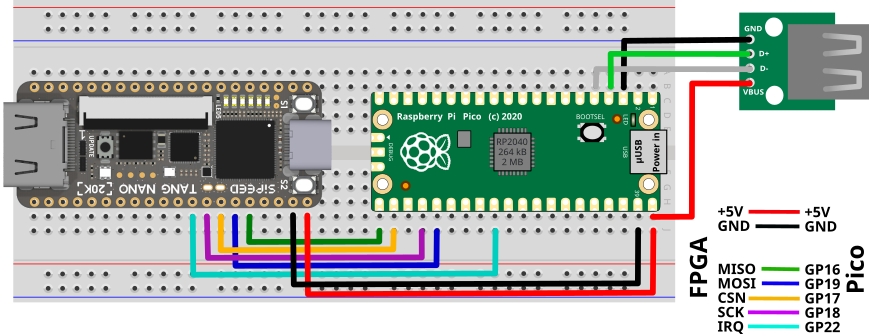

# MiSTeryNano FPGA companion Pi Pico / RP2040 variant

The is the variant of the MiSTeryNano FPGA companion firmware
for the Raspberry Pi Pico (W).

## Building

### Install the Pi Pico Toolchain (Ubuntu)
```
sudo apt install cmake gcc-arm-none-eabi libnewlib-arm-none-eabi build-essential
```

### Install the Pi Pico Toolchain (Fedora)
```
sudo dnf groupinstall "Development tools"
sudo dnf install clang cmake gcc-arm-linux-gnu arm-none-eabi-gcc-cs-c++ arm-none-eabi-gcc-cs arm-none-eabi-binutils arm-none-eabi-newlib
```

### Download an install the Pi Pico SDK

Download the [Raspberry Pi Pico SDK](https://github.com/raspberrypi/pico-sdk)
and set the ```PICO_SDK_PATH``` environment variable to point to the
SDKs root directory.

```
git clone https://github.com/raspberrypi/pico-sdk --recursive
export PICO_SDK_PATH=<full-path-to-clones-sdk>
```

### Update the TinyUSB component

The TinyUSB inside the Pico SDK needs to be at least version 0.17.0.

To update it go to pico-sdk/lib and install PIO-USB do:

```
cd pico-sdk/lib
mv tinyusb tinyusb.old
git clone https://github.com/hathach/tinyusb.git
cd tinyusb
python3 tools/get_deps.py rp2040
```

### Clone this respository

Thhis repository has to be cloned recursively to make sure the submodules
are included.

```
git clone https://github.com/harbaum/FPGA-Companion.git  --recursive
cd FPGA-Companion
```

Alternally do a

```
git submodule update --init
```

after a non-recursive clone to update the submodules.

### Run cmake and make

To start the build process create a build directory and start the
compilation:

```
cd src/rp2040
mkdir build
cd build
cmake ..
make
```

The resulting file named ```fpga_companion.uf2``` is loaded onto the
Pico as usual. Once successfully booted the Pico's LED will blink.

Additional debug output is sent via UART at 921600 bit/s on GP0 on
a regular Pi Pico or Pico(W) and at 460800 bit/s on Waveshare RP2040-Zero.

# Pin usage

| Pin | Signal | Description |
|---|---|---|
| GP0  | UART_TX  | Serial debug output |
| GP2  | USB D+ | USB PIO host D+ |
| GP3  | USB D- | USB PIO host D-   |
| GP16 | MISO | SPI data from FPGA |
| GP17 | CSn | SPI chip select to FPGA |
| GP18 | SCK | SPI clock to FPGA |
| GP19 | MOSI | SPI data to FPGA |
| GP22 | IRQn | SPI interrupt from FPGA |

## Using the internal micro USB connector

The RP2040 can use the pins GP2 and GP3 for a USB host port as
depicted below. This is the default configuration for the
FPGA Companion, although it's possible to use the standard
on-board micro USB connector instead.

To do so in the file ```tusb_config.h``` the PIO USB
needs to be disabled by setting the following value
to 0:

```
// change to 0 if using on-board native micro USB
// change to 1 if using pico-pio-usb as host controller for raspberry rp2040
#define CFG_TUH_RPI_PIO_USB   1
```

To use this you need a micro-USB to USB-A-OTG adapter.

# Example wiring



# Using the Waveshare RP2040-Zero

The Raspberry Pi Pico is rather big and only comes with a Micro USB
port. The [Waveshare RP2040-Zero](https://www.waveshare.com/rp2040-zero.htm) is a little
smaller and comes with a USB-C connector which makes it easier to use
it as a USB host using a regular USB-C to USB-A host adapter.

To build the firmware for the RP2040-Zero use the following
command:

```
cmake -DWS2040_ZERO=ON ..
```

The build process will then end with the following message:

```
Firmware has been built for Waveshare RP2040-Zero.
```

The SPI pins used on the RP2040-Zero differ from the ones used on the
regular pico:

| Pin | Signal | Description |
|---|---|---|
| GP0  | UART_TX  | Serial debug output |
| GP4 | MISO | SPI data from FPGA |
| GP5 | CSn | SPI chip select to FPGA |
| GP6 | SCK | SPI clock to FPGA |
| GP7 | MOSI | SPI data to FPGA |
| GP8 | IRQn | SPI interrupt from FPGA |

Also the RP2040-Zero comes with a WS2812 RGB led instead of a regular
LED. Driving the RGB LED requies a PIO unit and thus cannot be used at
the same time as the PIO-USB. The native USB of the RP2040-Zero must
therefore always be used, anyway.

# Convenient development

The RP2040 is by default somewhat inconvenient to develop for
as it has to be mounted manually as mass-storage to copy the
uf2 file onto it.

It's thus recommended to use a second Pi-Pico as a SWD programming
adapter. The details are explained in appendix A of
[Getting started with Raspberry Pi Pico](https://datasheets.raspberrypi.com/pico/getting-started-with-pico.pdf) under section ```Debug with a second Pico```.

The ```CMakeLists.txt``` file already contains a matching target and
with openocd installed a simple ```make flash``` should upload the
new firmware via the second Pico.

